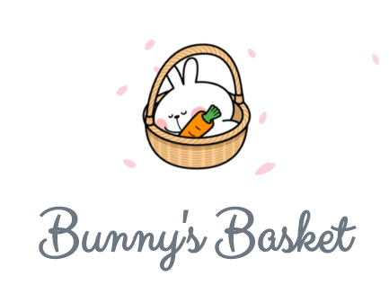
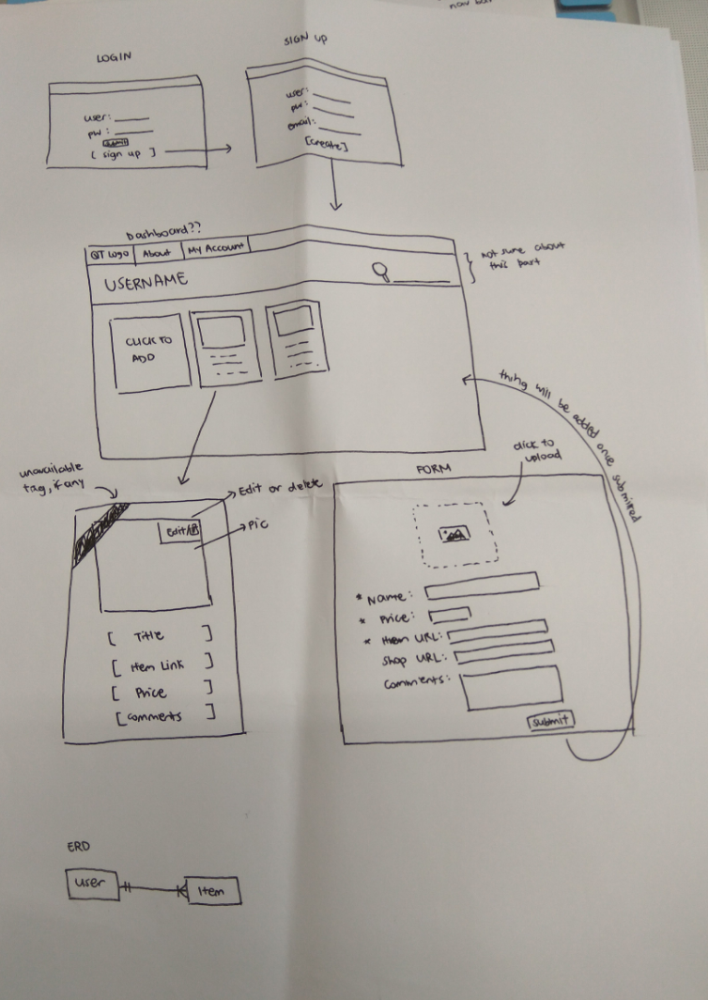
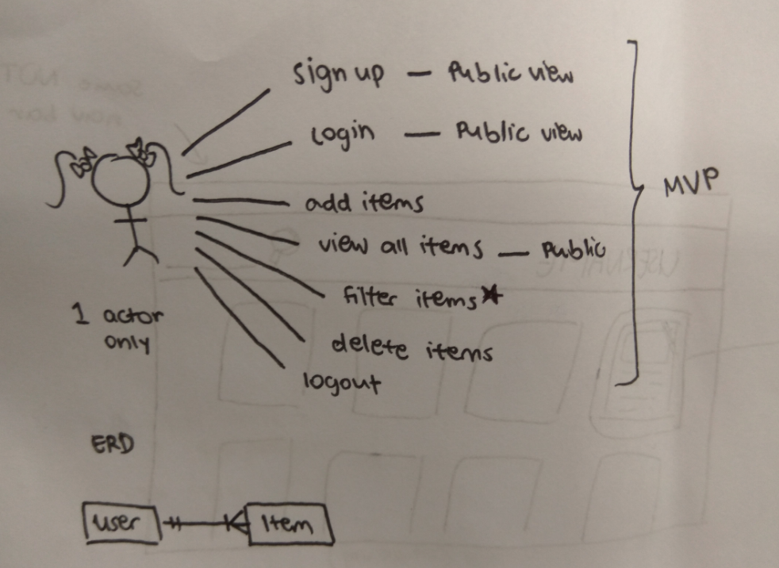
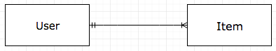

# Bunny's Basket (wdi-project-2)


A :sparkles:**shopping bookmark**:sparkles: application that allows you to bookmark items you plan to buy and view them all in one place.

But isn't there already a bookmark function on your browser for this?

Ha I'm glad you asked!

Using this application will allow you to:
1. Bookmark from anywhere, anytime! What if you were surfing the net on your friend's/school's/????? computer and you saw something you really liked? You're not going to bookmark it on some random browser or sign your poor friend out of Google Chrome just so you can bookmark one item.

2. View nice and big images of your bookmarked items. After all, online shopping is all about visuals and your browser bookmark function is not going to allow you to see pictures of your item unless you click into it.

3. Add helpful descriptions and comments that will aid in your decision-making process in the future when you are reviewing the item.

PLUS you can also tag and sort your items according to your whims and fancies.

App is live [here](https://wdi-project-2-imouto2005.herokuapp.com/)!

### User flow demo


## Built with
* Node
* Express
* JavaScript
* Embedded JavaScript
* CSS
* jQuery (teeny tiny bit)

## Workflow & Planning
### Brief Timeline
1. Think very VERY hard on what to do
2. Start sketching out brief layouts and ERD diagram for reference
3. Set up models
4. Put in routes and controllers
5. Realise that some of the controllers were mistakenly placed in the routes and refactor to put them where they belong
6. Styling with CSS
7. Deploy! :rocket:

### Rough sketches of wireframes


#### ERD


One user can have many bookmarked items.


## Development

### Notable Challenges

#### 1. Integrating API results into schema

As my item schema contains certain fields overlapping with the API output fields, mainly the title, description and image url, I wasn't sure about handling the interactions between the two.

##### Solution:

part I: Pass default values as strings into the overlapping fields when item is created.
```
Item.create({
  title: "default",
  url: req.body.url,
  description: "default",
  imageurl: "default",
  tag: req.body.tag,
  user_id: req.user._id,
}
```
part II: Update schema with results from the API
```
var encoded = encodeURIComponent(req.body.url)
var url = 'http://api.linkpreview.net/?key=' + process.env.LINK_PREVIEW_API_KEY + '&q=' + encoded
request(url, function(error, response, body) {
  var parseBody = JSON.parse(body)
Item.update({ _id: createdItem._id }, {
  $set: {
    title: parseBody.title,
    description: parseBody.description,
    imageurl: parseBody.image
  }
}
```

#### 2. Handling (sometimes) disappointing API output
Due to the mysterious workings of the link preview API used, it was unable to pull out images from certain domains, resulting in an empty string being passed instead of an image url. Which basically means, NO PICTURE! :scream:

Fiddling with the API was out of the question because:
1. I have no idea how and will probably end up ruining it in the process
2. It was working perfectly fine on other domains

##### Solution:
part I: Use a placeholder 'NO IMAGE FOUND' image if no image url could be retrieved from a certain website.

part II: Allow users to add their own image url.

part III: Change placeholder image to suit website theme better, as well as indicate to users that they can add their own image if they want.

## Further Development :kissing:
* Put the item description into cards for better uniformity
* Sort items by date created (apparently this is not the default!)
* Add in before delete hook
* Make it more 'community driven'

## Resources & References
* [Link Preview API](http://www.linkpreview.net/?ref=codingislove.com)
* [Simple Registration Form](http://codepen.io/cguillou/pen/EzHhx/)
* [CSS Pulse Animation](https://paulund.co.uk/create-pulse-effect-with-css3-animation)
* [jQuery Sakura Plugin](https://github.com/timoschaefer/jQuery-Sakura)
* [Stack Overflow (as always)](http://stackoverflow.com/)

## Author
* **ME** - [imouto2005](https://github.com/imouto2005)

## Acknowledgements

Really sorry to the following people who I had to harass in order to get this project done :bow:
* [Boa](https://github.com/siawyoung)
* [Tom Cheese](https://github.com/dorkblue)
* [Yi Sheng](https://github.com/yisheng90)
